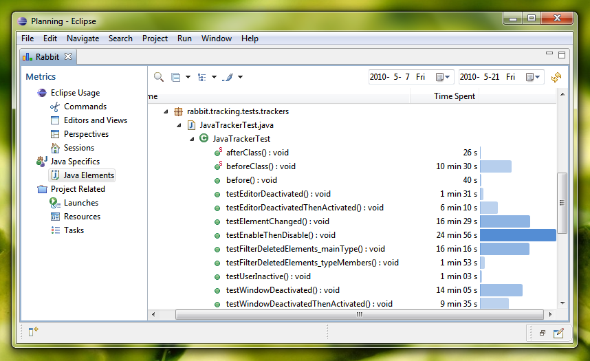
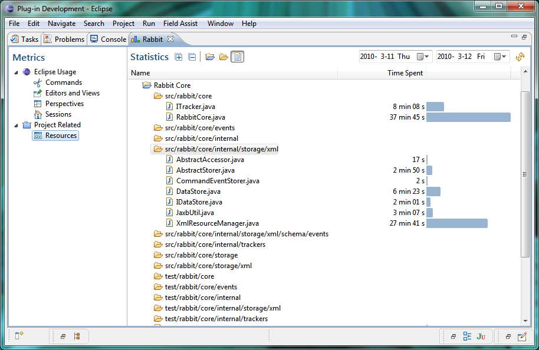

# My First Open Source Project

Back in early 2010, when I was fresh out of university, and was still
looking for my first programming job, I started working on my very
first open source project. It was inspired by the last year group
project at the university, I thought I had a few ideas that could take
it further, so I decided to start from scratch.

It's more a decade ago at this point, so I have forgotten most of the
things about it, but I still remember spending most of my free time,
day and night, half lying on the couch (not recommended) with my [Dell
Studio 15](https://en.wikipedia.org/wiki/Dell_Studio) laptop at the
time, designing features, class diagrams, writing code, unit tests, UI
tests, reading about good coding practices and applying them on the
project, purely for fun, I loved it, and I had learned so much in the
process.

It was called Rabbit (I couldn't think of better names at the time), a
plugin for [the Eclipse IDE](https://www.eclipse.org/ide/), [hosted on
Google Code](https://code.google.com/archive/p/rabbit-eclipse/) with
SVN, later moved to Git, it tracks statistics on what functionalities
you use and how you spent your time in the IDE. For example, how often
you use each command, how much time you spent editing each file, it
even tracks how much time you spent writing each Java function (I was
quite proud of that feature). The user interface was also pretty
awesome, it lets you specify a date range for the data to view, allows
you to aggregate the data in a few different ways, and draws a bar
graph on the side for visualization.

Here are some historical screenshots (all stats shown are actual stats
of me spent working on the project):

And according to the GitHub stats, I've added ~270K lines and removed
~225K lines of code cross a period of about a year and half between
2010 and 2011, and the project contains roughly ~45K lines of code.

Being an open source project, it has received a few [feature requests
and bug
reports](https://code.google.com/archive/p/rabbit-eclipse/issues). And
I have had some interesting email exchanges with others as well:

* André from the University of Zurich was expanding on the code as
  part of his bachelor thesis.

* Russell from Auburn University wanted to use the plugin in one of
  his spring classes, and he even extended it to support tracking time
  spent on Python classes/functions.

* Someone tried to use the plugin as a way to "keep people on track",
  as they believed their programmers weren't as honest as they would
  like them to be...

Now skimming through the project code, it's actually somewhat clean,
well organized, and comes with a lot of unit/integration tests. But of
course, being a young programmer at the time, I have also made quite a
few beginner mistakes, like having useless comments that are pretty
much repeats of the function names, or the lack of proper error
handling, in some places I just catch the error, print it and continue
execution.

Eventually, due to other interests and life commitments, I stopped
working on it, but the things I've learned from it has stayed me
throughout my career:

* **Don't be afraid of doing things you don't know how to do (yet)**.
  I had no idea on how to do any of things when I first started, but
  it was the desire and willingness to learn that helped me figure
  things out along the way, and that has also helped improve my
  research and problem solving skills.

* **Think before you code**. I spent a lot of time thinking about how
  to architect the features, I remembered I stopped coding for days
  and spent the time thinking how to make the core of the code base
  extensible, once I figured it out, I was able to add new features in
  very short amount of time. So sometimes you need to slow down so you
  can go faster later.

* **Best way to learn is by doing**. If you want to be good at
  something you have to practice and practice. You can't learn to ride
  a bike by just reading about it.
