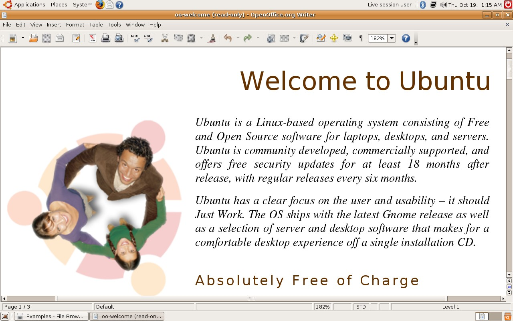
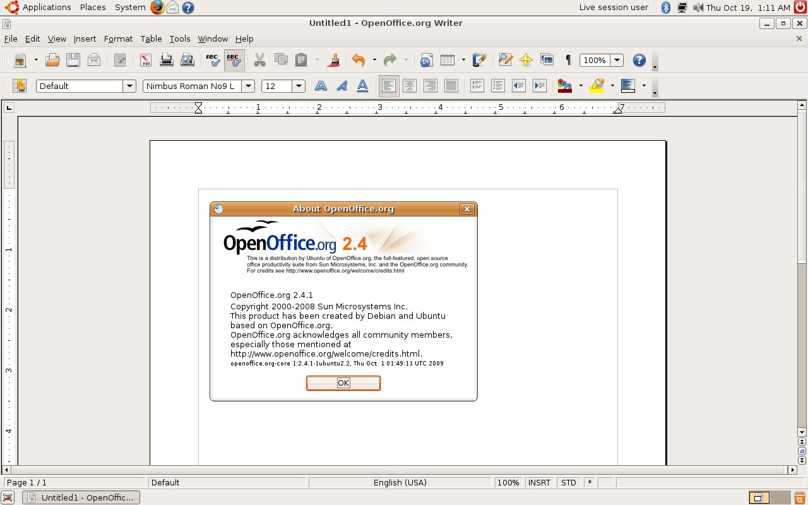
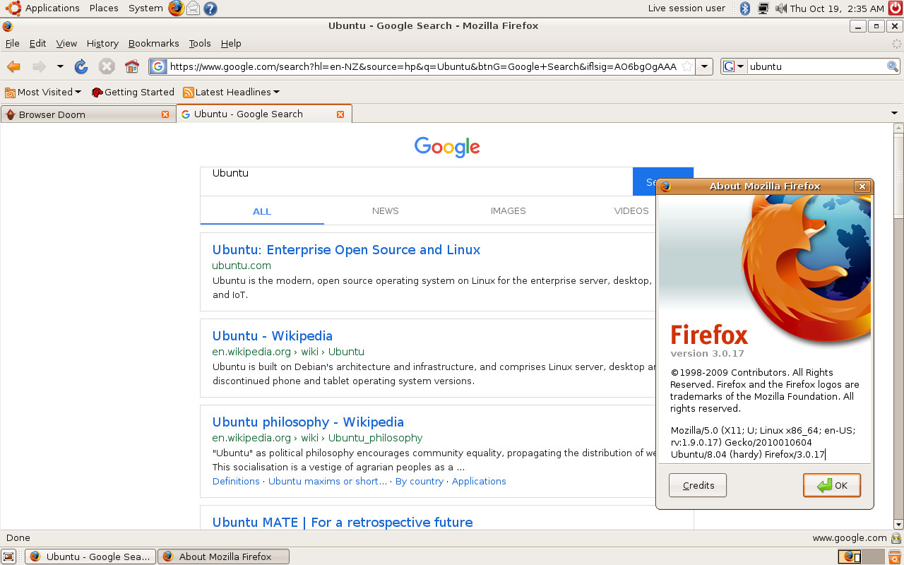

# Ubuntu 8.04

Back in the days when new versions of Ubuntu were being released, you
can actually request an installation CD to be sent to you, and
Canonical would do so free of charge. Recently while sorting some old
stuff out, I have found such a CD, it was for Ubuntu 8.04 (Hardy
Heron). So for fun I booted it up, and here are some obligated photos
and screenshots.

Only needs 384MB of RAM. 👴

> Ubuntu has a clear focus on the user and usability - it should Just
> Work.

That's arguably still true to this day, at least when compared to
vanilla Gnome.

Pretty surprised to see Google automatically loads a version of itself
that works in such an old version of Firefox, while others like Bing
and DuckDuckGo would just straight up refused to load.
