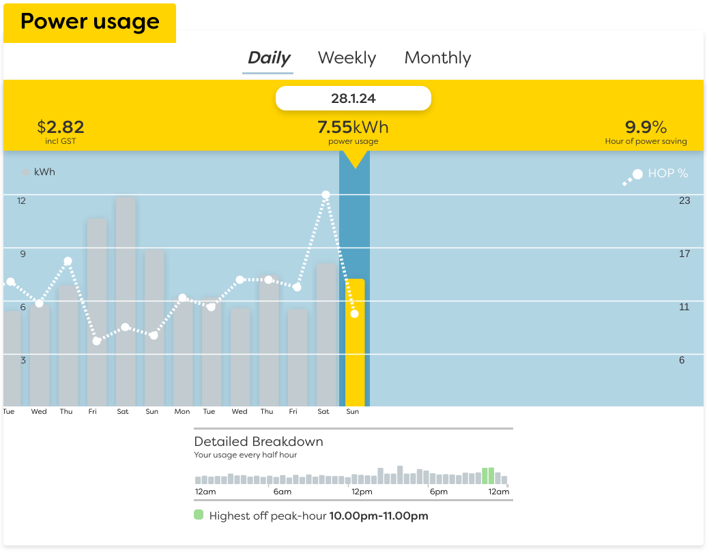

# Finding My Cheapest Power Plan

It's been a few years since I last switched power company, so I
thought it's time to check things out again to see if I can save some
electricity costs. But I didn't want to just go to each company's
websites and compare the rates, I want to calculate the rates against
my actual power usage to get the concrete costs for my specific usage
pattern.

I'm currently with Electric Kiwi, and on my account page I can see a
breakdown of my usages:



To get the raw data behind this is fairly straight forward, with the
help of the browser's dev tools, I can inspect the request being made,
then change a few parameters and retrieve all my usage data for the
whole of 2023. The JSON payload looks something like this:

```json
{
  "data": {
    "usage": {
      "2023-12-31": {
        "intervals": {
          "1": {
            "consumption": "0.17",
            "time": "12:00 AM",
            ...
          },
          "2": {
            "consumption": "0.10",
            "time": "12:30 AM"
            ...
...
```

It's essentially a list of half hour buckets of the whole of 2023. We
can extract the bits we want with a little Python:

```python
class HalfHourlyUsage(NamedTuple):
    start: datetime
    kwh: Decimal

with open("half_hourly.json") as input:
    data = json.load(input)

half_hourly_usages = [
    HalfHourlyUsage(
        datetime.strptime(f"{date} {interval['time']}", "%Y-%m-%d %I:%M %p"),
        Decimal(interval["consumption"]),
    )
    for date, usage in data["data"]["usage"].items()
    for interval in usage["intervals"].values()
]
```

Which essentially gives us the start time of the half hour, and the
amount of electricity used for that half hour in kWh:

```
2023-12-10 23:00:00, 0.78
2023-12-10 23:30:00, 1.27
...
```

Now with the data in hand, we can go through the power companies and
calculate their advertised rates against this usage data. For example,
given a company's low user plan, which has a daily fixed cost of
$0.69, day rate of $0.3117/kWh, and night rate of $0.1507/kWh, we can
calculate the total cost like so:

```python
def calculate_cost(
    usages: list[HalfHourlyUsage],
    day_rate: Decimal,
    kwh_rate: Callable[[datetime], Decimal],
) -> Decimal:
    days_cost = day_rate * sum(
        366 if calendar.isleap(year) else 365
        for year in {usage.start.year for usage in usages}
    )
    kwhs_cost = sum([kwh_rate(usage.start) * usage.kwh for usage in usages])
    return days_cost + kwhs_cost

cost = calculate_cost(
    half_hourly_usages,
    day_rate=Decimal("0.69"),
    kwh_rate=lambda time: Decimal("0.3117")
    if 7 <= time.hour < 23
    else Decimal("0.1507"),
)
```

After going through some calculations, here are the list of plans I've
compared against my usage data for 2023, cost is the total cost for
year 2023, sorted by lowest first:

| Plan                             | Cost      |
|----------------------------------|-----------|
| Electric Kiwi, PowerShifter      | $1,044.93 |
| Electric Kiwi, Prepay 300        | $1,065.79 |
| Electric Kiwi, MoveMaster        | $1,208.05 |
| Contact Energy, Good Nights      | $1,213.87 |
| Contact Energy, Good Weekends    | $1,263.42 |
| Flick, Flat                      | $1,297.27 |
| Powershop                        | $1,326.64 |
| Frank Energy                     | $1,332.78 |
| Electric Kiwi, Stay Ahead 200    | $1,354.49 |
| Flick, Off Peak                  | $1,368.08 |
| Genesis, Energy Basic            | $1,376.88 |
| Genesis, Energy Plus             | $1,392.48 |
| Meridian, Simple                 | $1,449.76 |
| Contact Energy, Basic            | $1,461.11 |
| Electric Kiwi, Kiwi              | $1,471.59 |
| Contact Energy, Broadband Bundle | $1,526.30 |

My current plan is Electric Kiwi Stay Ahead 200, if I switch to
PowerShifter, it would be a saving of ~$300 per year, or ~23% cheaper.
But PowerShifter requires switching broadband to them, I don't want to
do that, so I'll probably go with Prepay 300 instead.
